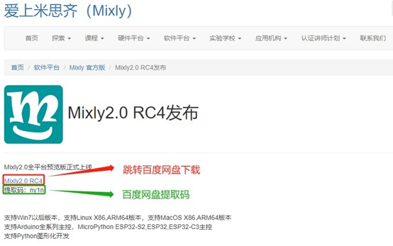
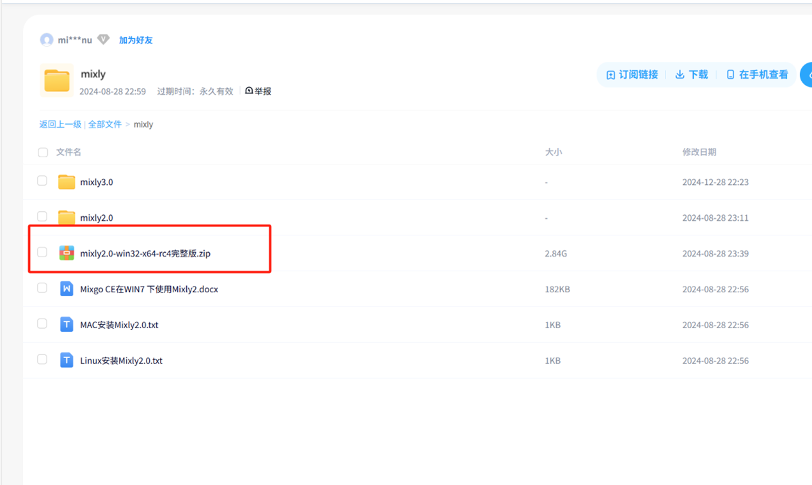
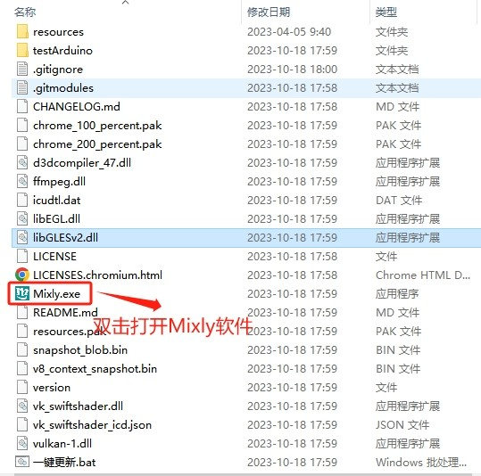
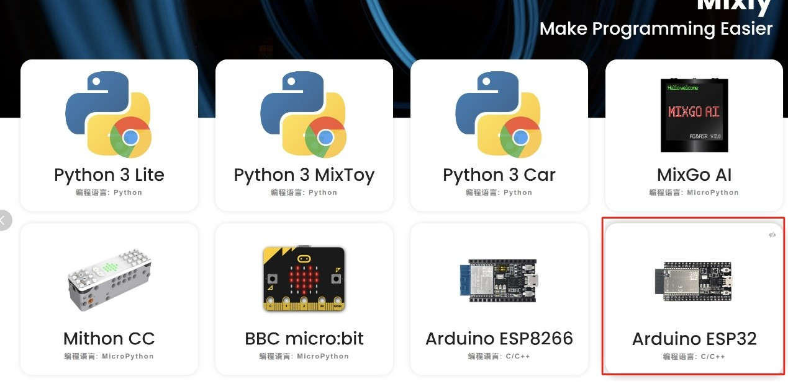
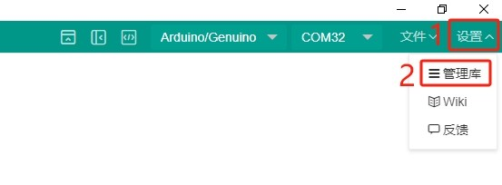
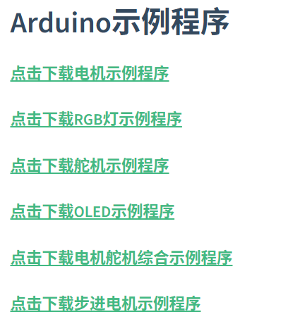
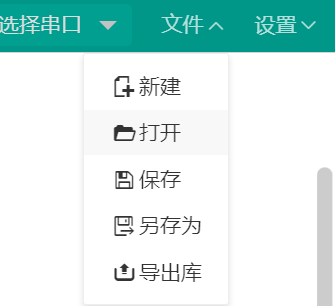
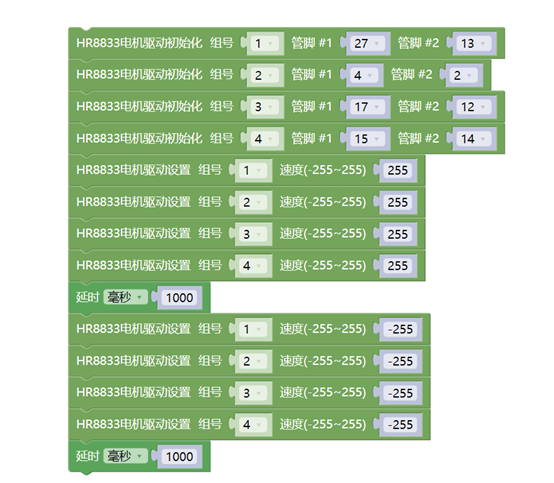

# Mixly安装与使用

## Mixly安装教程
- 一、官网下载
 https://mixly.cn/bnu-maker/mixl2.0rc
 
 跳转百度网盘后，点击Mixly2.0文件夹，显示以下文件:
 
 下载完之后，将文件解压，解压的目录不要有中文、空格等；安装目录不要太长，目录最好放到每个电脑盘的根目录。
打开解压后的文件夹，请双击"一键更新.bat"文件，按照提示安装，在此不做详细描述。等安装完成，双击“Mixly.exe”打开Mixly软件，如下图：
 

- 二、使用方法
 打开界面后，找到并选择Arduino ESP32
 
 之后关注界面右上角，打开导入窗口。点击右上角”设置“按钮，选择”管理库“。如下图：
 
 https://emakefun.github.io/emakefun-docsify/#/zh-cn/esp32/maker_esp32/maker_esp32?id=mixly%e7%a4%ba%e4%be%8b%e7%a8%8b%e5%ba%8f
 打开以上网址，任意下载一个你感兴趣的方面，回到Mixly打开并选择你刚下的文件，就会出现文件选择框，选择 mix 后缀的文件即可
 
 
 
 上图以电机代码作为示例
 连接板子,点击上传，传到板子上即可使用
