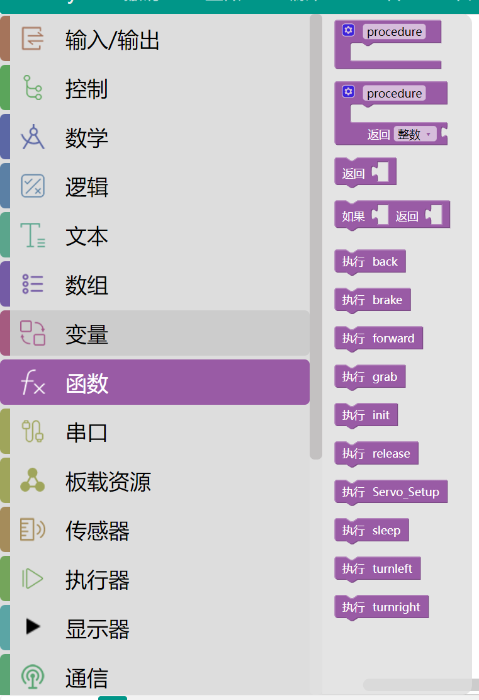

# Mixly界面简单介绍

## Mixly界面不同分区简要介绍

 •	**基础模块区和库模块区**： 同种类型的积木被分在同个模块中并赋予同种颜色，每块积木代表一条控制指令。
 •	**功能区**： 对项目文件的创建、保存，库的导入、导出、管理，串口连接与上传程序，控制板选择进行操作的区域。
 •	**程序构建区**： 是放置从基础模块区和库模块区拖拽出来的积木块的地方。
 •	**代码区**： 拖拽出积木后，点击“代码”，可以看到你拖拽的模块对应的C语言代码。
 •	**缩放控制区**： 可以将软件操作界面进行缩放。
 •	**垃圾箱**： 用来移除不需要的积木块。

## 基础模块区和库模块区使用方法

- **一、​输入/输出**​​：
 **功能**​​：控制硬件引脚的电平状态或读取传感器数据。
​ 1.**​数字输入/输出**​​：设置引脚为高/低电平（如控制LED开关）或读取数字信号（如按钮状态）。
​ 2.**​模拟输入/输出**​​：读取模拟信号（如电位器值）或输出PWM信号（如调节LED亮度）。
​​ 3.中断控制​​：配置硬件中断触发条件（如上升沿、下降沿）。
​ 4.​脉冲长度​​：测量脉冲宽度（如超声波测距）

- **二、控制​**​：
 **功能​**​：控制程序执行流程。
​ 1.**​初始化**​​：程序启动时仅执行一次的代码块，对应Arduino的setup()函数。
​ 2.**​循环**​​：重复执行的代码块，对应loop()函数。
​ 3.**​条件判断**​​：如果、如果-否则模块，实现分支逻辑。
​ 4.**​循环结构**​​：重复、重复直到等模块，支持计数循环和条件循环

- **三、数学**​​：
 **功能**​​：数值运算与处理。
​ 1.**​基础运算**​​：加、减、乘、除、取模等。
​ 2.​高级运算​​：三角函数、对数、幂运算、随机数生成等。
 3.​​数值处理​​：取整、约束范围（如map函数）、绝对值等

- **四、逻辑**​​：
 **功能**​​：逻辑判断与运算。
​ 1.**​比较运算**​​：大于、等于、小于等。
​ 2.**​逻辑运算**​​：与（AND）、或（OR）、非（NOT）等。
​ 3.​三元运算符​​：?运算模块，简化条件赋值

- **五、文本与数组**​​：
 1.**文本操作**​​：
字符串连接、截取、转换（如数字转文本）。
​ 2.​数组操作​​：
定义数组、存取元素、修改长度等

- **六、变量与函数​**​：
 支持整型、浮点型、布尔型等变量，以及自定义函数

- **七、网络WiFi**
 **功能**：快速实现设备接入本地Wi-Fi网络，为后续通信提供基础。
 **Wi-Fi网络连接管理​​**:
​​配置连接参数​​，通过拖拽积木设置SSID和密码（设置Wi-Fi名称"ssid"密码"password"）实时监测连接状态（Wi-Fi连接事件和Wi-Fi连接状态积木）

- **八、自定义模块**
 **功能**：用户自定义代码扩展​​
​ 1.​自由编程接口​​：允许用户突破图形化积木的限制，直接编写或嵌入原生代码，实现更复杂或个性化的功能。
 ​2.混合编程支持​​：
图形化积木与文本代码可混合使用（例如在图形化流程中插入Serial.print打印变量值）。
​ 3.​灵活输入输出​​：
支持变量传递（如将图形化积木中的变量名直接用于自定义代码块）。
