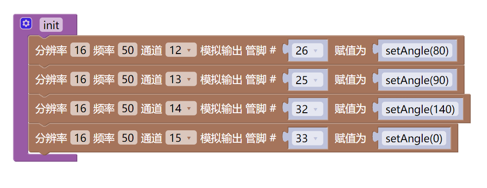

# 项目实践：Mixly下代码的复现
## 驱动电机、舵机部分

- **一、初始化**
* **初始化串口**
<br>找到Serial波特率板块，初始化为115200

* **电机、舵机驱动初始化**
<br>由于舵机在后续函数的编写中带有初始化，此处仅对电机做说明
<br>找到HR8833电机驱动初始化，根据管脚号分别对4组电机管脚进行初始化

- **二、自定义函数**
* 1.**控制电机具体步骤**
<br>在函数部分选中无返回值、无参数自定义函数
<br>找到HR8833电机驱动设置，设置速度


 * 2.**控制舵机具体步骤**
 <br>在函数部分选中有返回值、有参数自定义函数，主要用于计算并返回duty值，控制舵机角度,示例如下：


 <br>实现对抓手运动状态控制的函数采用无返回值、无参数自定义函数，使用输入\输出部分绑定管脚赋值的图形模块


- **三、常见问题**
* 电机与舵机驱动采用不同图形模块，注意区分
* 电机部分组号要依次设置为1-4，这样可以保证PWM通道从0开始
* 舵机部分由于绑定引脚+赋值图形模块采用ledcWrite函数，因此提前自定义setAngle函数用于计算duty值，需以如下形式写入具体函数：


## 连接WiFi、发送指令部分

- **一、初始化**
* **WiFi连接**
<br>找到链接WiFi图形，输入需要连接的WiFi名称和密码

* 初始化代码样例


- **二、发送指令部分**
* 声明变量
<br>由于后续效果是使用键盘快捷键控制小车运动，因此此处需要声明字符类型的变量key

* TCP服务端初始化
<br>在设置-管理库-导入库中选择小绿科技-WIFI V2 Free,下载并导入
<br>选择TCP服务端初始化模块，链接名默认client

* 快捷键与函数的对应
<br>找到如果-执行模块，先判断client是否可用
<br>嵌套重复-执行模块，若符合client有链接的条件重复执行以下内容
<br>再次嵌套如果-执行模块，判断是否满足client有数据可读条件
<br>将key赋值为client中读取的单字节并打印
<br>嵌套如果-执行-否则如果执行模块，判断key是否与目标的单字节相同，若相同则执行相应函数

* 代码样例


- **三、TCP下向服务端发送消息**
* 此处以Vscode下编写的代码为示例
* 创建一个python文件，写入以下内容：

```
import socket

# 创建socket对象
socket_client = socket.socket()
# 连接到服务器
socket_client.connect(("172.16.203.162", 80))
//此处需将172.16.203.162替换为实际的IP地址

# 持续发送和接收消息
while True:
    send_msg = input("请输入要发送给服务端的消息：")
    if send_msg == "exit":
        break
    socket_client.send(send_msg.encode("UTF-8"))

# 关闭连接
socket_client.close()
```

- **四、常见问题**
* **key变量定义的必要性**：
<br>首先，TCP通信是流式传输，可能分多次接收数据。key作为缓冲区，暂存数据，确保每次只处理一个明确的指令字节。
​<br>​其次，全局变量key可以在不同函数或条件分支中共享，避免重复读取客户端数据（可能引发数据错位）。
​<br>若未来需要支持更多指令（如速度调节），只需扩展key的取值判断逻辑，无需重构通信部分。

* 要在如果-执行模块添加否则执行的方法与自定义函数中添加参数的方法相同，通过点击左上角设置并将模块拖拽到如果/输入中即可