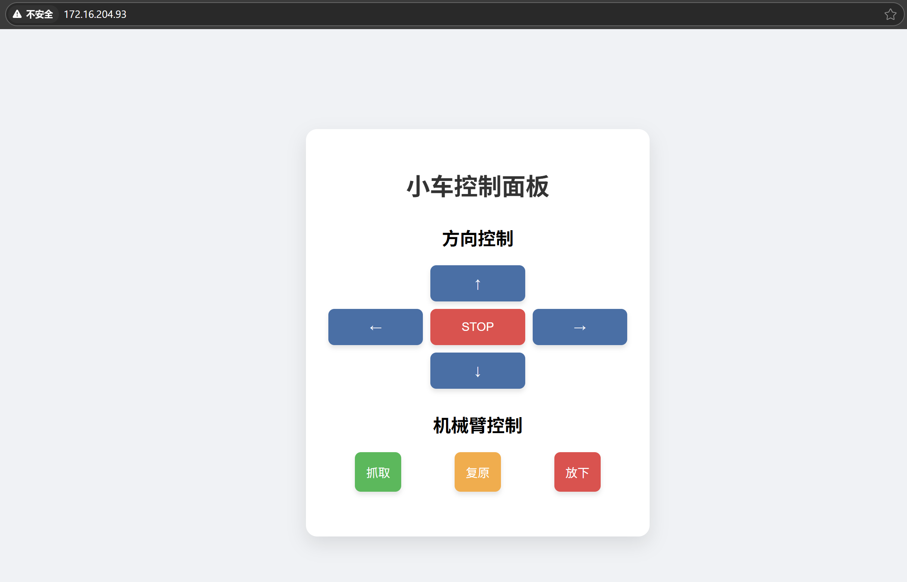

# ESP32搭建网络服务

## 网页搭建简单介绍

- ESP32可以搭建简单的Web服务器，通过浏览器访问ESP32的IP地址即可获取响应

## 网页搭建基本代码架构

- 必要头函数
  <br>`#include <ESPAsyncWebServer.h>`
  
- HTML页面嵌入方式
  <br>直接字符串嵌入​​：适合简单页面
  <br>`const char index_html[]PROGMEM=R"rawliteral(<html><body><h1>ESP32 Control Panel</h1><button onclick="fetch('/led?state=1')">Turn ON</button></body></html>)rawliteral";`

- 代码样例
```
const char* webpage = "<!DOCTYPE html><html lang=\"zh-CN\"><head><meta charset=\"UTF-8\"><meta name=\"viewport\" content=\"width=device-width,initial-scale=1.0\"><title>小车控制面板</title><style>body{font-family:Arial,sans-serif;background:#f0f2f5;display:flex;flex-direction:column;align-items:center;justify-content:center;height:100vh;margin:0;padding:20px;}.container{background:#fff;border-radius:15px;box-shadow:0 10px 25px rgba(0,0,0,0.1);padding:30px;width:100%;max-width:400px;text-align:center;}h1{color:#333;margin-bottom:30px;}.control-section{margin-bottom:30px;}.direction-pad{display:grid;grid-template-columns:repeat(3,1fr);gap:10px;margin-bottom:20px;}.btn{background:#4a6fa5;color:#fff;border:none;border-radius:8px;padding:15px;font-size:16px;cursor:pointer;transition:all 0.3s;box-shadow:0 4px 6px rgba(0,0,0,0.1);}.btn:hover{background:#3a5a80;transform:translateY(-2px);box-shadow:0 6px 8px rgba(0,0,0,0.15);}.btn:active{transform:translateY(0);box-shadow:0 2px 4px rgba(0,0,0,0.1);}.btn-up{grid-column:2;}.btn-left{grid-column:1;grid-row:2;}.btn-stop{grid-column:2;grid-row:2;background:#d9534f;}.btn-right{grid-column:3;grid-row:2;}.btn-down{grid-column:2;grid-row:3;}.arm-control{display:flex;justify-content:space-around;margin-top:20px;}.btn-grab{background:#5cb85c;}.btn-release{background:#d9534f;}.btn-reset{background:#f0ad4e;}.btn-grab:hover{background:#4cae4c;}.btn-release:hover{background:#c9302c;}.btn-reset:hover{background:#ec971f;}</style></head><body><div class=\"container\"><h1>小车控制面板</h1><div class=\"control-section\"><h2>方向控制</h2><div class=\"direction-pad\"><button class=\"btn btn-up\" onclick=\"sendCommand('up')\">↑</button><button class=\"btn btn-left\" onclick=\"sendCommand('left')\">←</button><button class=\"btn btn-stop\" onclick=\"sendCommand('stop')\">STOP</button><button class=\"btn btn-right\" onclick=\"sendCommand('right')\">→</button><button class=\"btn btn-down\" onclick=\"sendCommand('down')\">↓</button></div></div><div class=\"control-section\"><h2>机械臂控制</h2><div class=\"arm-control\"><button class=\"btn btn-grab\" onclick=\"sendCommand('grab')\">抓取</button><button class=\"btn btn-reset\" onclick=\"sendCommand('reset')\">复原</button><button class=\"btn btn-release\" onclick=\"sendCommand('release')\">放下</button></div></div></div><script>function sendCommand(a){fetch('/control?action='+a).then(r=>{if(!r.ok)console.error('请求失败')}).catch(e=>console.error('请求错误:',e));}document.addEventListener('keydown',e=>{const k={ArrowUp:'up',ArrowLeft:'left',ArrowRight:'right',ArrowDown:'down',g:'grab',r:'release',s:'stop',t:'reset'}[e.key];if(k)sendCommand(k);});</script></body></html>";
```
- 代码解析
  
  * 1.**基本结构​​**
  <br>这是一个完整的HTML5页面，包含<!DOCTYPE>声明、中文字符集(UTF-8)和响应式视口设置。
  <br>**页面分为两个控制区**：
​  <br>(1)​方向控制​​：通过5个按钮（上、下、左、右、停止）发送指令。
  ​<br>(2)​机械臂控制​​：通过3个按钮（抓取、复原、放下）发送指令。
  
  * 2.**核心交互逻辑​​**
  <br>(1)按钮通过onclick事件调用sendCommand()函数，发送HTTP GET请求到ESP32的/control端点，例如：`fetch('/control?action=up')  // 发送"up"指令`
  <br>(2)支持键盘快捷键（方向键对应方向控制，g/r/s/t对应机械臂操作）。
  
  * 3.**​样式设计**​​
  <br>使用CSS Flex/Grid布局实现响应式按钮排列。
  <br>按钮有悬停/点击动画效果，不同功能按钮通过颜色区分（如红色表示停止）。
  
  * 4.**优化**
  <br>**​​换行符问题**​​:
  <br>原始代码中包含换行符（\n）和缩进，会增加字符串长度，可能超出ESP32的存储限制（尤其是Flash或NVS分区容量）。
  <br>换行符在不同系统中可能为\n（Unix）或\r\n（Windows），需统一处理。

## 预期实现成果

